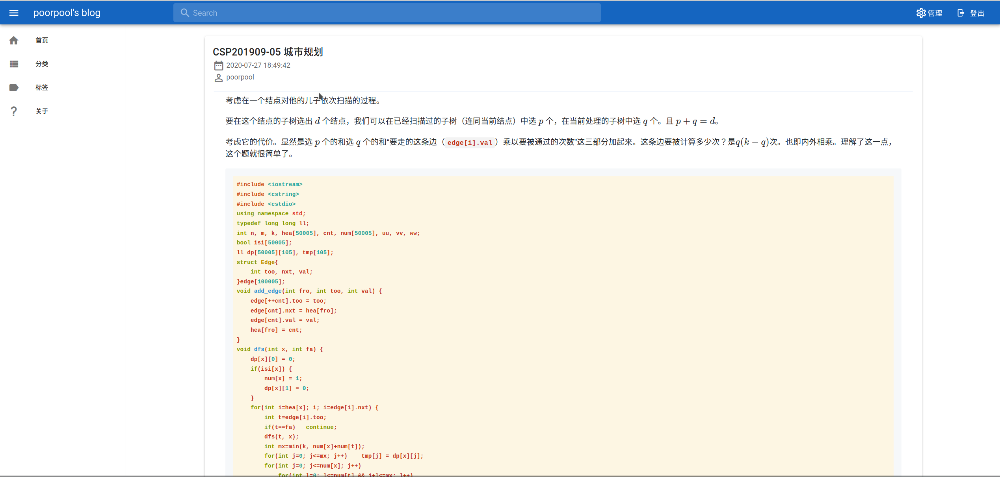
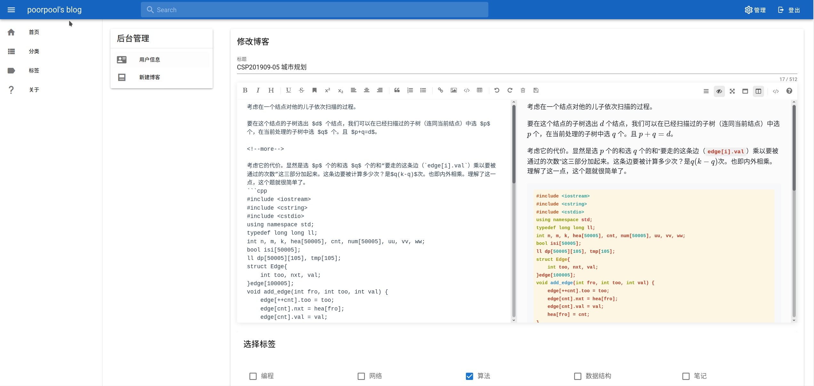

# poorpoolblog_frontend

v1.1

默认端口 8080。大约用到了 vuetify，vuex，vue router，mavon editor。

## Project setup
```
npm install
```

### Compiles and hot-reloads for development
```
npm run serve
```

### Compiles and minifies for production
```
npm run build
```

### Customize configuration
See [Configuration Reference](https://cli.vuejs.org/config/).

## screenshot



